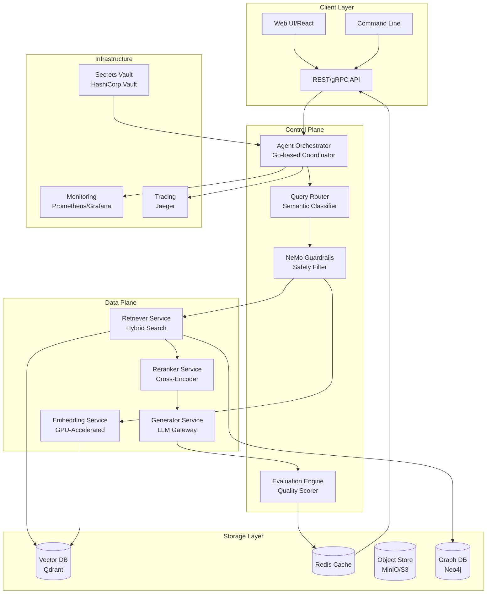
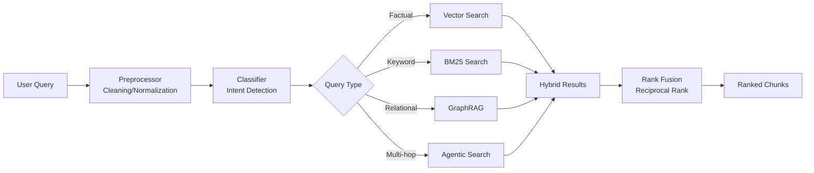
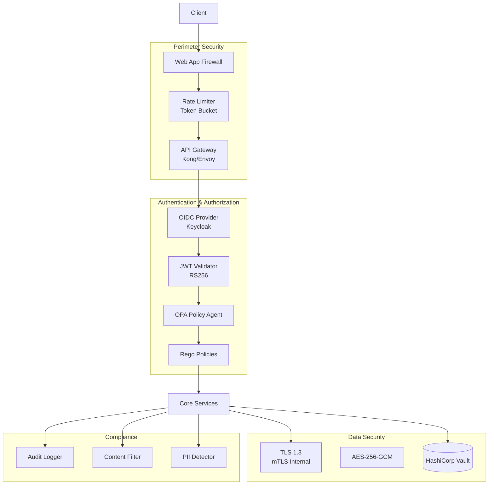
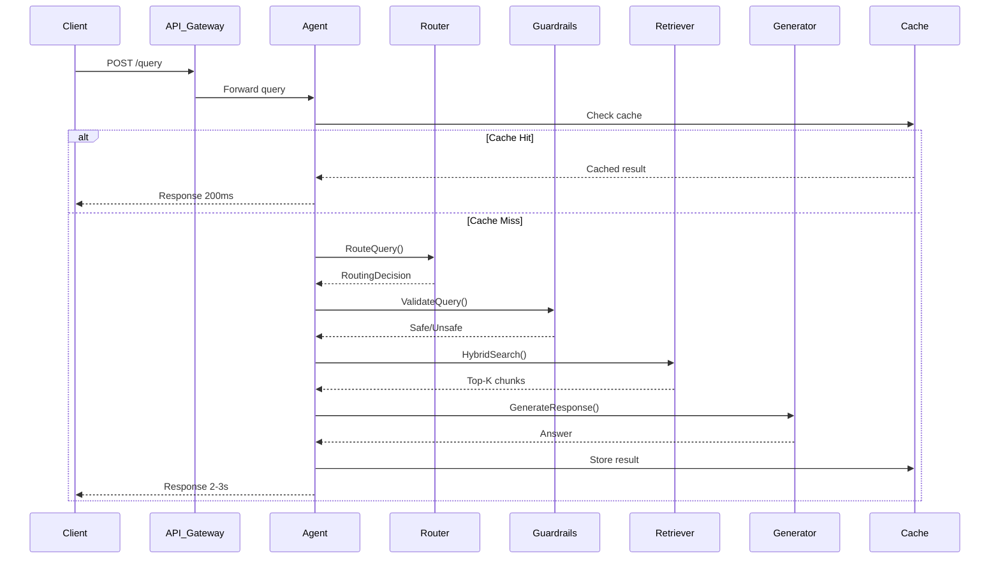
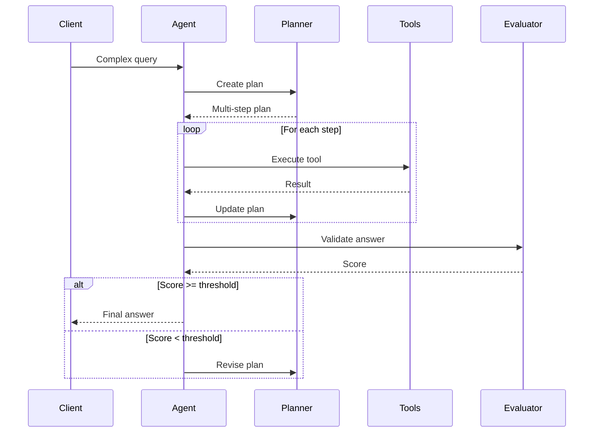
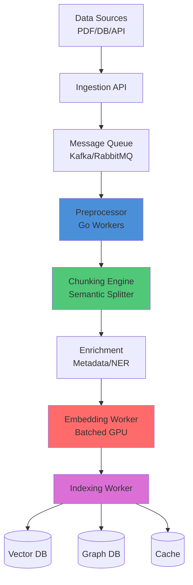
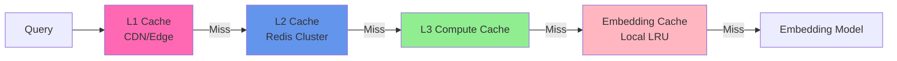

# AmaniQuery

**AI-Powered Legal & News Intelligence Platform for Kenya**

AmaniQuery is an AI agent framework designed to democratize access to legal information and civil education in Kenya. Built with a production-ready, Go-based RAG (Retrieval-Augmented Generation) architecture, it provides accurate, contextual answers about Kenya Law and current affairs.

---

## 🎯 Vision

**Democratizing Access to Information and Civil Education**

AmaniQuery aims to make legal knowledge accessible to every Kenyan citizen by:
- Providing accurate answers to legal questions in plain language
- Aggregating and contextualizing news relevant to civic matters
- Offering a reliable, fast, and secure platform for information retrieval

---

## 📐 Architecture Overview

### High-Level System Architecture

### Query Router & Semantic Classification

### Security Architecture

### Synchronous Query Flow

### Agentic Multi-Step Flow

### Data Ingestion Pipeline

### Multi-Tier Caching Strategy

---
